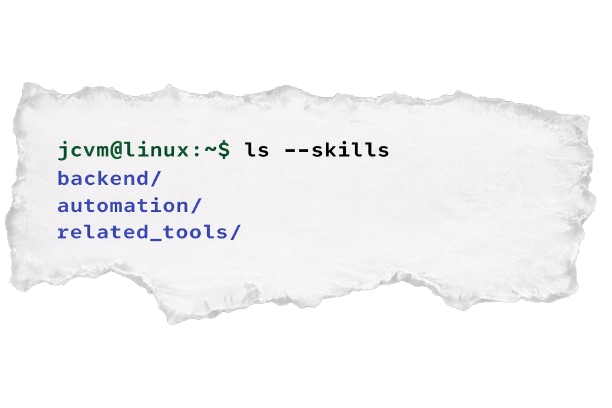

  

  
  
  
  
  

---

## Sobre mim

Sou desenvolvedor focado em **backend e automação**.

Trabalho transformando problemas reais em soluções simples:
scripts, APIs, bots e sistemas que eliminam tarefas repetitivas.

Não curto complexidade desnecessária prefiro código que:
- resolve
- é legível
- e dá pra evoluir sem dor

 

**Regra pessoal:**
> Se algo é repetitivo e leva mais de alguns minutos por dia, vale automatizar.

---

## O que estou focando agora

- Construir sistemas **que realmente são usados**
- Evoluir arquitetura backend (**modular, simples e escalável**)
- Melhorar automações sem virar código caótico
- Criar soluções que economizem tempo (meu e de outras pessoas)

---

  

---

## Stack

  
  
  
  
  
  

### Backend & Frameworks

  
  
  
  
  
  

### Banco de Dados

  
  
  
  
  
  

### DevOps & Ferramentas

  
  
  
  
  
  
  

### AI/ML & Data Science

  
  
  
  
  

---

## Contato

  <a href="https://www.linkedin.com/in/jcvm-dev/">LinkedIn</a>

